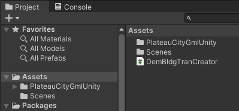
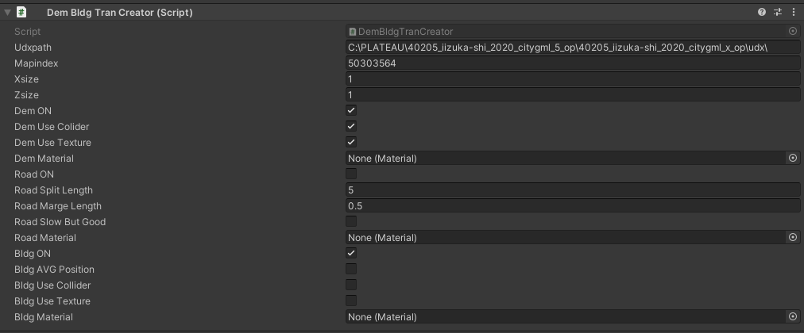
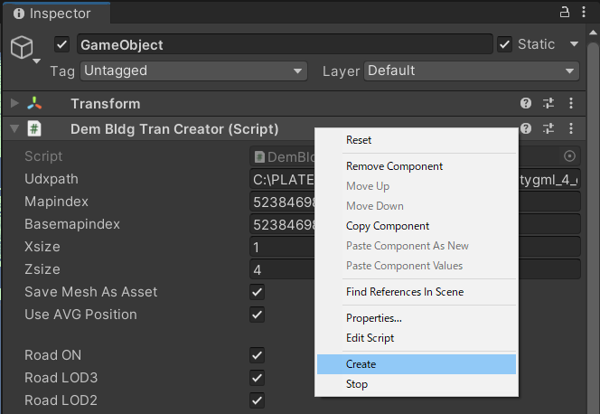
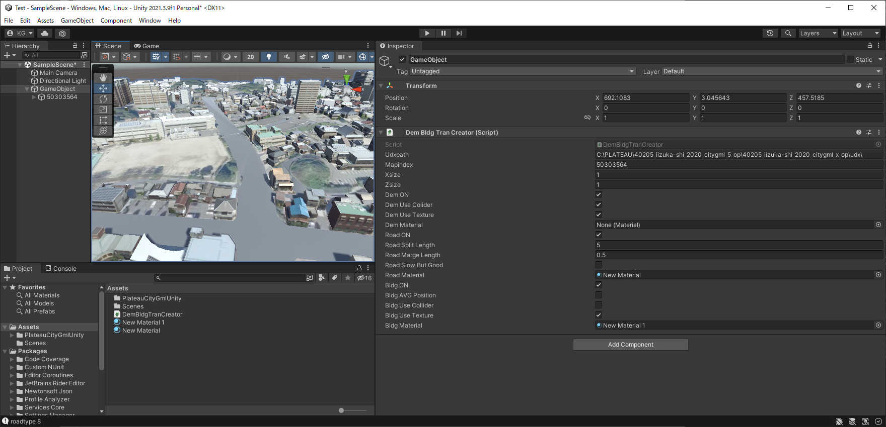
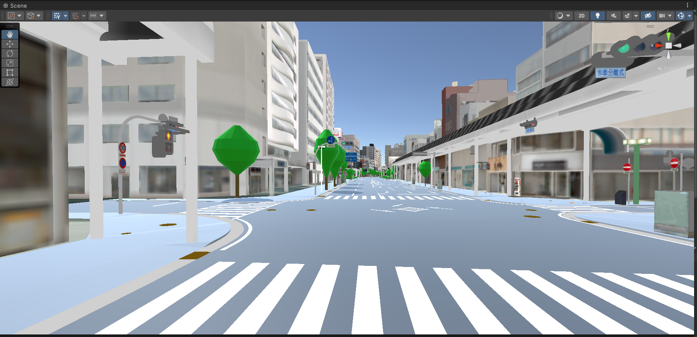
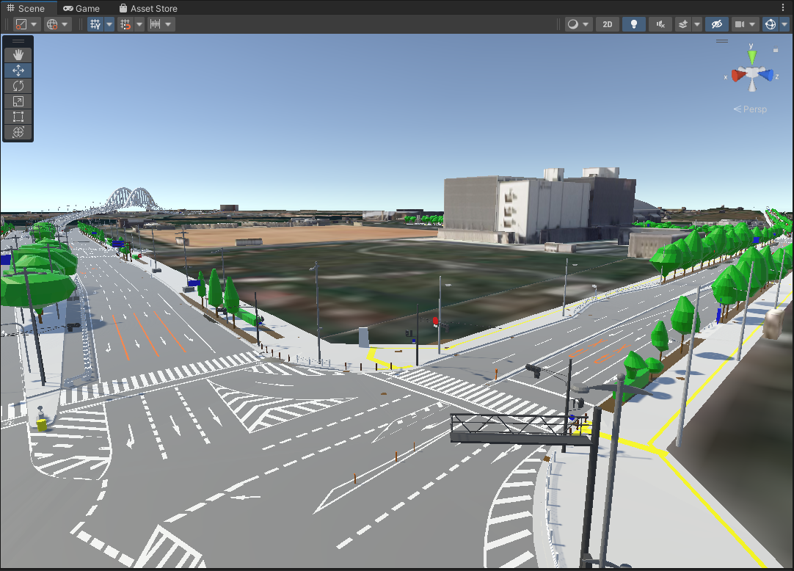

# PlateauCityGmlUnity
[こちらのリポジトリ](https://github.com/ksasao/PlateauCityGmlSharp)をUnityで直接CityGMLのファイルを読み込んで利用できるよう、Forkしたものです。

追加機能として、地面のテクスチャを地理院地図の画像を自動ダウンロードして使用し、道路(TranのRoad)を地形の高さに合わせて生成します。

2023/2/18 沼津のLOD3のBldg,Tran,Frn,Vegデータに対応しました。Coroutineを使用し生成を中断できるようにしました。

2024/2/10 大阪のLOD3のエリアに対応しました。

# 使い方

1. DemBldgTanCreator.csとPlateauCityGMLUnityのフォルダをProjectに追加します。

2. HierarchyでCreate Emptyで空のゲームオブジェクトを追加します。

3. 追加した空のゲームオブジェクトにDemBldgTanCreator.csを追加します。

4. 追加したスクリプトのインスペクター（Dem Bldg Tran Creater (Script) - Inspector)を開き設定をします。

	gmlデータを置いてあるudxのフォルダーを udxpathに記入します。
	
	mapindexに生成したい場所のメッシュコードを記入します。
	
	あとは必要に応じて記入します。Textureを使わない場合はMaterialの設定をしておくのがお勧めです。
	

'''

    public string udxpath = @"C:\PLATEAU\40205_iizuka-shi_2020_citygml_5_op\40205_iizuka-shi_2020_citygml_x_op\udx\";
    public string mapindex = "50303564";     // メッシュの番号　８桁の数字の文字列　
    public string basemapindex = "50303564";     // メッシュの番号　８桁の数字の文字列　
    public int xsize = 1;               // x（経度方向）に何ブロック生成するか
    public int zsize = 1;               // z（緯度方向）に何ブロック生成するか
    public bool saveMeshAsAsset = false; // プレハブ化やパッケージ化するときはtrue
    public bool useAVGPosition = true; // 建物の位置をMeshの平均（yはMin）に
    
    public bool roadON = false;          // 道路を生成するならtrue
    public bool roadLOD3 = false;          // LOD3の道路を生成するならtrue
    public bool roadLOD2 = false;          // LOD2の道路を生成するならtrue
    public bool roadLOD2Array = false;          // 地面の高さの配列で高さを平均化するならtrue meshcodeが8桁の道路のみ　6桁は地面の高さから直接
    public float roadLOD2SplitLength = 5;    // 長い1辺のときの分割する長さ(m)
    public float roadLOD2MargeLength = 0.5f; // 近い点をまとめる長さ(m) // 別の面との同一点はみてないのでギャップがおこるかも。
    public bool roadLOD2SlowButGood = false; // よりよい分割（とりあえず長さが最小
    public bool roadUseCollider = false; // Colliderをアタッチするならtrue    
    public Material roadMaterial;       // 道のMaterial

    public bool demON = true;           // 地形を生成するならtrue
    public bool demUseCollider = true;   // 地形にColliderをアタッチするならtrue
    public bool demUseTexture = true;   // 地形に地理院地図の画像を貼るならtrue
    public bool demAdjustRoad = true;   // 地形を道路等の高さに合わせるて下げるならtrue    
    public Material demMaterial;        // 画像を貼らない場合のMaterial

    public bool bldgON = true;          // 建物を生成するならtrue
    public bool bldgLOD3 = false;          // LOD3の建物を生成するならtrue
    public bool bldgLOD2 = false;          // LOD2の建物を生成するならtrue
    public bool bldgUseCollider = false; // 建物にColliderをアタッチするならtrue
    public bool bldgLOD3UseTexture = false;  // 建物に画像を貼るならtrue
    public bool bldgLOD2UseTexture = false;  // 建物に画像を貼るならtrue
    public bool bldgLOD3UseColor = false;  // 建物を単色の色を付けるならtrue    
    public bool bldgLOD2UseColor = false;  // 建物を単色の色を付けるならtrue    
    public bool bldgMaxColor = false;  //  Textureから明るい色を取得するならtrueそうでなければ平均    
    public int bldgTexsize = 256;       // テクスチャのサイズ
    public Material bldgMaterial;       // 画像を貼らない場合のMaterial

    public bool frnON = true;          // 都市設備を生成するならtrue
    public bool frnUseCollider = false; // 都市設備にColliderをアタッチするならtrue
    public bool frnUseTexture = true;  // 都市設備に画像を貼るならtrue
    public int  frnTexsize = 256;       // テクスチャのサイズ
    public float frnOffsetY = 0.008f;   // 道路と重なりを避けるために上に少しあげる
    public bool frnSplit = true;        // 分割するならtrue

    public bool vegON = true;          // 植生を生成するならtrue
    public bool vegUseCollider = false; // 植生にColliderをアタッチするならtrue
    private bool vegUseTexture = false;  // 植生に画像を貼るならtrue

'''

5. スクリプトのインスペクターの名前を右クリックしてCreateで生成します。生成する内容に応じてしばらく時間がかかります。最初は、試しに地形(DEM)のみが良いと思います。中断する場合はスクリプトのインスペクターの名前を右クリックしてStopです。

# 一部のソースコードの引用元はWEBアーカイブより参照できます
`Assets\DemBldgTranCreator.cs`

道路(Tran - Road)の三角形ポリゴンへの分割は以下を使用
Triangulator - Unify Community Wiki
http://wiki.unity3d.com/index.php?title=Triangulator
https://web.archive.org/web/20210622183655/http://wiki.unity3d.com/index.php?title=Triangulator

