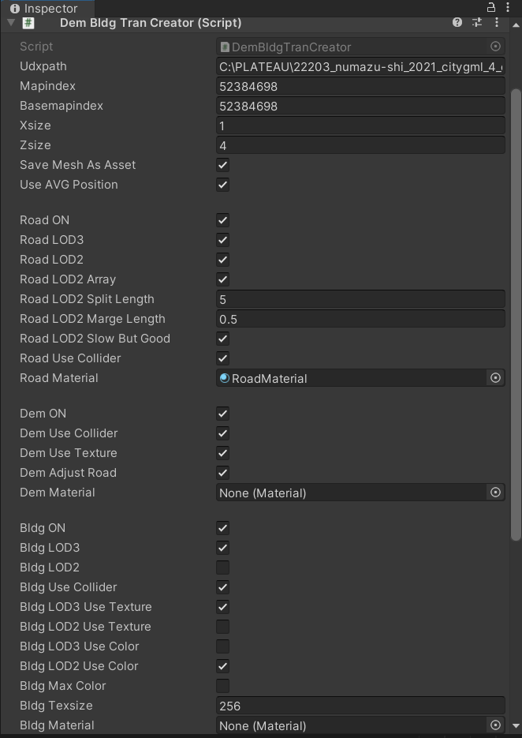
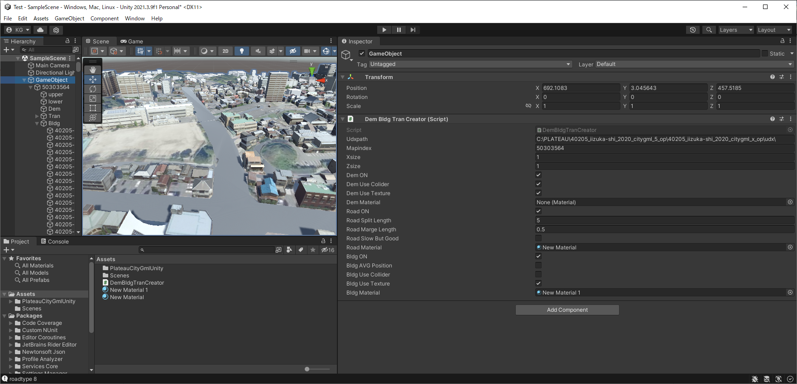

# PlateauCityGmlUnity
[こちらのリポジトリ](https://github.com/ksasao/PlateauCityGmlSharp)をUnityで直接CityGMLのファイルを読み込んで利用できるよう、Forkしたものです。
追加機能として、地形のテクスチャを地理院地図の画像を自動ダウンロードして使用し、道路(TranのRoad)を生成します。

# 使い方

1. DemBldgTanCreator.csとPlateauCityGMLUnityのフォルダをProjectに追加します。

2. HierarchyでCreate Emptyで空のゲームオブジェクトを追加します。

3. 追加した空のゲームオブジェクトにDemBldgTanCreator.csを追加します。

4. 追加したスクリプトのインスペクター（Dem Bldg Tran Creater (Script) - Inspector)を開き設定をします。

	gmlデータを置いてあるudxのフォルダーを udxpathに記入します。
	
	mapindexに生成したい場所のメッシュコードを記入します。
	
	あとは必要に応じて記入します。

5. スクリプトのインスペクターの名前を右クリックしてCreateで生成します。生成する内容に応じてしばらく時間がかかります。最初は、試しに地形(DEM)のみが良いと思います。

# 一部のソースコードの引用元はWEBアーカイブより参照できます
`Assets\DemBldgTranCreator.cs`

道路(Tran - Road)の三角形ポリゴンへの分割は以下を使用
Triangulator - Unify Community Wiki
http://wiki.unity3d.com/index.php?title=Triangulator
https://web.archive.org/web/20210622183655/http://wiki.unity3d.com/index.php?title=Triangulator

